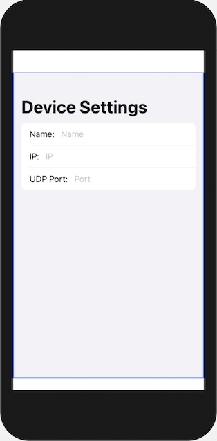
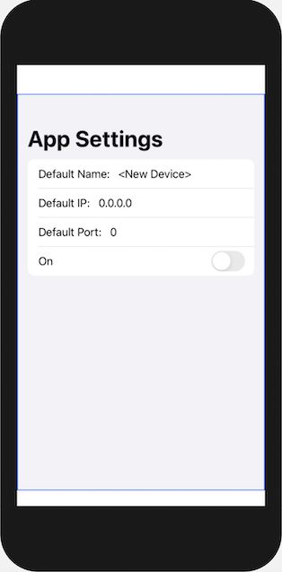

# RemoteControl
iOS app to turn on and off wifi-enabled remote relays

This app is an advance version of https://github.com/creatica-soft/RemoteSwitch. It supports multiple relays and provides default settings view.

in addition to SwiftUI and Network frameworks, this app also uses Core Data to store the relay's parameters such as name, IP address and UDP port.

